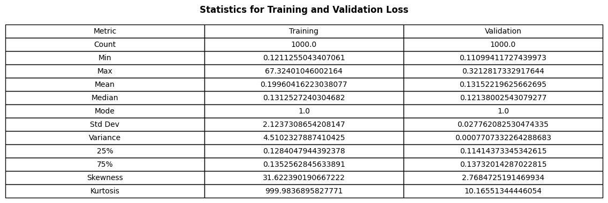
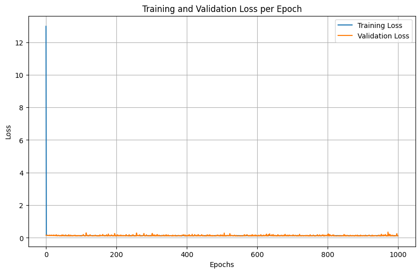

# Model Card

This model was developed as part of Project 01 of the Machine Learning discipline (PPGEEC2318) in the Graduate Program in Electrical and Computer Engineering at UFRN.

<!-- TOC -->
* [Model Card](#model-card)
* [Model Details](#model-details)
* [Intended Use](#intended-use)
* [Training Data](#training-data)
* [About Dataset](#about-dataset)
  * [Data Source](#data-source)
  * [Metadata](#metadata)
* [Metrics](#metrics)
* [Ethical Considerations](#ethical-considerations)
* [Caveats and Recommendations](#caveats-and-recommendations)
<!-- TOC -->

# Model Details

The model was developed by Pedro Costa Aragão as an individual project. The pipeline was built using PyTorch and involves the following steps: exploratory analysis, preprocessing, implementation of the logistic regression model, training, evaluation, and documentation of the results.

The goal is to predict the chance of a candidate being admitted to an MBA based on variables such as GRE score, TOEFL, college grade, research experience, among others.

The full code, including the mba_admission_2025.ipynb notebook, is available in this repository.

# Intended Use

This model was created exclusively for educational purposes, with the aim of applying the theoretical concepts of binary classification, logit regression and supervised learning to a real dataset.

# Training Data

#%% md
# About Dataset

## Data Source

Synthetic data generated from the Wharton Class of 2025's statistics.

## Metadata

- **application_id**: Unique identifier for each application
- **gender**: Applicant's gender (Male, Female)
- **international**: International student (TRUE/FALSE)
- **gpa**: Grade Point Average of the applicant (on 4.0 scale)
- **major**: Undergraduate major (Business, STEM, Humanities)
- **race**: Racial background of the applicant (e.g., White, Black, Asian, Hispanic, Other / null: international student)
- **gmat**: GMAT score of the applicant (800 points)
- **work_exp**: Number of years of work experience (Year)
- **work_industry**: Industry of the applicant's previous work experience (e.g., Consulting, Finance, Technology, etc.)
- **admission**: Admission status (Admit, Waitlist, Null: Deny)

The target variable was converted to a binary variable (admitted: 1 if chance of admission ≥ 0.75, 0 otherwise), transforming the problem into a classification task.

The dataset was divided as follows:

**Training**: 80%

**Test**: 20%

Besides, the training set was split into training and validation sets (75% training, 25% validation).

# Metrics

| Mean AUC | Std. Dev. |
|----------|-----------|
|   0.8227 | 0.0134    |

# Ethical Considerations

This model is a simplification of a real selection process. Many other factors (interviews, personal history, diversity, etc.) are ignored. Furthermore, the original dataset may contain biases, for example, related to university origin or previous experience.

# Caveats and Recommendations

The model uses an arbitrary binary split for the chance of admission (threshold of 0.75).

No advanced class balancing techniques were performed, although the data is reasonably balanced.

The model's performance can be improved by hyperparameter tuning, deeper neural networks, or ensemble techniques.